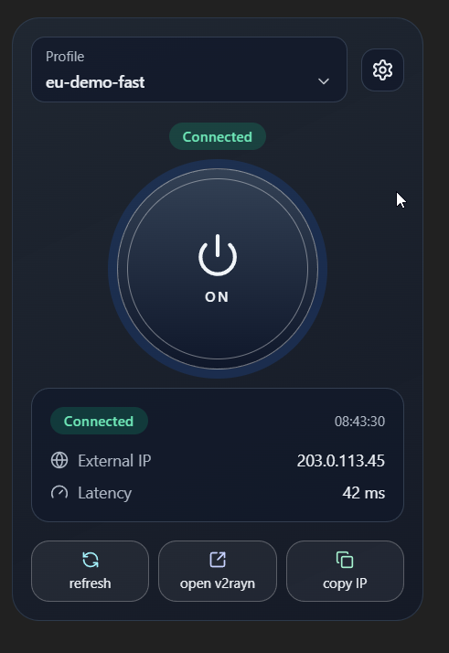
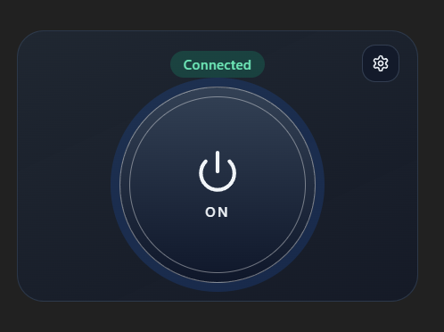

# v2rayN Widget (TUN Mini-Dashboard)

Portable Windows utility app for fast v2rayN control in TUN mode.

## UI Preview





## Important warning (permissions and user context)

Run the widget under the same user account and privilege level as v2rayN.

If v2rayN is started as Administrator (typical for TUN mode), start this widget as Administrator too.
Mixed context (admin vs non-admin, or different users/sessions) can break UI automation for toggle/profile actions.

## Why this project exists

The default v2rayN window is functional but large and not convenient for always-visible monitoring.
This widget keeps VPN status in front of the user, allows quick actions (toggle/refresh/profile switch), takes less space, and looks like a compact utility panel.

If something does not fit your workflow, fork and send PRs.

## Goal

Deliver a polished floating app that:
- lives in system tray,
- shows real-time connection state,
- controls **Enable TUN** quickly,
- supports EN/RU localization,
- stores app settings (path/theme/polling/language/window/options),
- works without modifying v2rayN source code.

## Stack

- Rust backend + Tauri desktop runtime
- React + TypeScript + Vite frontend
- Tailwind CSS
- Zustand state store
- i18next JSON localization

## Current MVP capabilities

- Rounded floating widget, light/dark themes
- Tray icon menu + close-to-tray
- Startup + manual + periodic status refresh
- Combined status resolver (`Connected / Disconnected / Error / Unknown`)
- External IP and latency display controls
- Read profiles and active profile from v2rayN data
- Experimental profile switching from UI
- Settings panel with runtime controls:
  - language
  - theme
  - always-on-top
  - autostart with Windows
  - poll interval (numeric seconds)
  - time format
  - show/hide profile selector
  - mockup mode (fake profile/IP/latency/status for screenshots/streams)
  - show/hide action buttons
  - show/hide external IP and latency
  - latency mode + endpoints
  - v2rayN path auto/manual + detect/validate/reset
  - window transparency effect + opacity slider

## Important behavior

- `toggle_tun_via_ui` is targeted for **Enable TUN**.
- Primary path: window automation.
- Fallback path: config toggle of `EnableTun` (+ restart if needed).
- Other toggle modes are out of current scope and should be added via fork/PR.

## Known limitations

- Transparent undecorated windows on Windows can still show platform-specific artifacts depending on GPU/driver/compositor.
- UI automation remains version-sensitive across v2rayN builds.
- Profile switching is marked experimental.
- Portable flow only (no installer yet).

## Project layout

```text
project-root/
  README.md
  docs/
    PRD.md
    architecture.md
    research-notes.md
    ui-reference.md
    tasks.md
  scripts/
    rust-env.ps1
    test-rust.ps1
    build-portable.ps1
  src/
    frontend/
    tauri/
```

## Development

### Frontend

```bash
cd src/frontend
npm install
npm run dev
```

### Tauri

```bash
cd src/tauri
cargo tauri dev
```

## Rust isolated environment (project-local)

Rust runs with repository-local homes (virtualenv-like isolation):
- `CARGO_HOME=<repo>/.cargo-home`
- `RUSTUP_HOME=<repo>/.rustup-home`

```powershell
./scripts/rust-env.ps1 -Bootstrap
./scripts/test-rust.ps1
```

## Build portable executable

```powershell
./scripts/build-portable.ps1
```

Output: `dist/portable/v2rayn-widget.exe`
(or timestamped file if target exe is locked by a running process).

## v2rayN folder expectations

Configured v2rayN folder must contain:
- `v2rayN.exe`
- `guiConfigs/`
- `guiLogs/`

The app reads:
- `guiConfigs/guiNConfig.json`
- `guiConfigs/guiNDB.db` (profiles)
- latest file in `guiLogs/`

## Status resolution

Signals combined:
- config TUN flag
- v2rayN process state
- log markers
- health check result
- external IP availability

## Logging

App logs are written to user config directory:
- `v2rayn-widget/logs/widget.log`

## ToDo / next

- Add dedicated leak-check page (DNS/WebRTC/IP leak diagnostics).
- Validate profile switching reliability for subscription-driven setups.
- Add installer build flow (not only portable).
- Cross-platform roadmap: Linux/macOS support only after platform-specific v2rayN control path is validated on real systems.
